<a href="https://purvalsingh.github.io">
  
</a>

<p align="center">
  
</p>

<p align="center">
  <a href="https://purvalsingh.github.io"></a>
  <a href="https://purvalsingh.github.io/space-invaders/"></a>
  <a href="https://www.linkedin.com/in/purval-singh-052724332/"></a>
  <a href="https://leetcode.com/u/purvalsingh/"></a>
  <a href="mailto:purvalsingh@yahoo.com"></a>
</p>

<p align="center">
  
  
  
</p>

---

## 🛰️ Mission brief

```bash
$ whoami --verbose
```

- 🎓 **Education:** Computer Engineering at **Ramrao Adik Institute of Technology**, Mumbai
- 🌐 **Focus:** Websites with real motion, full-stack apps, automation and small games
- 🏆 **Hackathons:** Smart India Hackathon 2026 with team **Logic_Lords** (KrishiSetu)
- 🔐 **Background:** Started out in cybersecurity and digital forensics
- 🤖 **How I build:** AI as a co-pilot, then test everything before it ships
- 💼 **Open to:** Projects, collabs and internships

---

## 🧰 Toolkit

<div align="center">

### Languages
<p></p>

### Frontend
<p></p>

### Backend & Data
<p></p>

### Tools
<p></p>

</div>

---

## 🚀 Missions

| Project | What it is | Stack | Link |
| :--- | :--- | :--- | :--- |
| **🌾 KrishiSetu** | Farmer-first agricultural marketplace, built for Smart India Hackathon 2026 | `Next.js` `Prisma` `TypeScript` | [Live ↗](https://krishisetu-weld.vercel.app) |
| **🏋️ FORGE** | Offline-first fitness PWA: training, nutrition, steps and goals | `TypeScript` `PWA` `Supabase` | [Live ↗](https://forgefit-one.vercel.app) · [Code ↗](https://github.com/purvalsingh/forge-fitness-app) |
| **🏭 Trimbak Plastics** | Brand website for a plastics manufacturer with a full scroll and hover motion layer | `HTML` `CSS` `JavaScript` | [Live ↗](https://trimbakplastics.vercel.app) |
| **🎙️ Socially Blends** | Motion-heavy website for a dubbing studio | `HTML` `CSS` `JavaScript` | [Live ↗](https://socially-blends.vercel.app) |
| **⚔️ Wayfarer's Guild** | Roblox life-sim RPG | `Lua` `Roblox` | [Code ↗](https://github.com/purvalsingh/wayfarers-guild) |
| **👾 Space Invaders** | The arcade classic, rebuilt from scratch in Canvas and Web Audio | `Canvas` `Web Audio` | [Play ↗](https://purvalsingh.github.io/space-invaders/) |

---

## 📡 Telemetry

<p align="center">
  
</p>

<p align="center">
  
</p>

---

## 🐍 Orbit log

<p align="center">
  
</p>

---

<p align="center">
  <i>"Hand-built, no templates. The portfolio has more to look at, and a game."</i>
</p>

<p align="center">
  
</p>
